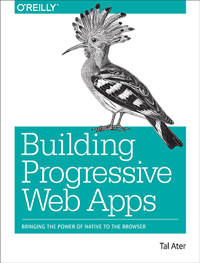

# Awesome Progressive Web Apps 

A curated collection of Progressive Web Apps resources.

> Progressive web apps are a new breed of web apps. They combine the benefits of a native app with the low friction nature of the web. Progressive web apps start off as simple websites, but as the user interacts with them, they progressively gain new powers. They transform from a website into something much more like a traditional native app.
>
> -- <cite>[Building Progressive Web Apps - O'Reilly](https://pwabook.com/oreillyapwa)</cite>

If you want to contribute, please read the [contribution guidelines](contributing.md).

## Contents

- [Must Reads](#must-reads)
- [Learning Resources](#learning-resources)
- [Browser Support](#browser-support)
- [Videos](#videos)
- [Case Studies](#case-studies)
- [Sample Progressive Web Apps](#sample-progressive-web-apps)
- [Specific Technologies](#specific-technologies)
  - [Service Workers](#service-workers)
  - [CacheStorage API](#cachestorage-api)
  - [Background Sync](#background-sync)
  - [Push Notifications](#push-notifications)
  - [IndexedDB](#indexeddb)
  - [Installable Web Apps](#installable-web-apps)
    - [App Icons](#app-icons)
  - [Web Share APIs](#web-share-apis)
- [Awesome Performance](#awesome-performance)

## Must Reads

- [Building Progressive Web Apps - O'Reilly Media](https://pwabook.com/oreillyapwa) - A deep dive into progressive web apps, service workers, push notifications, background sync, IndexedDB, offline first and much more.
- [Offline Web Applications Using IndexedDB & Service Worker](https://www.udacity.com/course/offline-web-applications--ud899) - A free Udacity course introducing the basic concepts of building a progressive web app.

## Learning Resources

- [Google Developers - Your First Progressive Web App](https://developers.google.com/web/fundamentals/getting-started/your-first-progressive-web-app/?hl=en) - A step-by-step guide to building a progressive web apps using the app shell pattern.
- [Awesome Service Workers](https://github.com/TalAter/awesome-service-workers) - A collection of awesome resources for learning service workers.
- [Service Workers W3C Specification](https://www.w3.org/TR/service-workers/) - The official service workers spec.

## Browser Support

- [Can I Use - Service Workers](http://caniuse.com/#feat=serviceworkers) - Up-to-date browser support table of ServiceWorker API.
- [Is Service Worker ready?](https://jakearchibald.github.io/isserviceworkerready/) - Current status of ServiceWorker support in different browsers.

## Videos

- [Instant Loading: Building offline-first Progressive Web Apps - Google I/O 2016](https://youtu.be/cmGr0RszHc8) - A quick dive into the most common technologies and techniques for building progressive web apps.
- [Intro To Progressive Web Apps](https://www.udacity.com/course/intro-to-progressive-web-apps--ud811) - This free Udacity course by Google covers intro to PWAs, service workers and web app manifests.
- [Offline Web Applications Using IndexedDB & Service Worker](https://www.udacity.com/course/offline-web-applications--ud899) - This free Udacity course is a must if you're planning to dive deep into service workers.
- [Progressive Web Apps (Chrome Dev Summit 2015)](https://www.youtube.com/watch?v=MyQ8mtR9WxI) - An introduction to progressive web apps by Alex Russell and Andreas Bovens.
- [Polymer and Progressive Web Apps: Building on the modern web - Google I/O 2016](https://www.youtube.com/watch?v=fFF2Yup2dMM) - Using Polymer to build progressive web apps.

## Case Studies

- [Building the Google I/O 2016 Progressive Web App](https://developers.google.com/web/showcase/2016/iowa2016) - Building and launching a progressive web app using web components, Polymer, and material design.
- [AliExpress Case Study](https://developers.google.com/web/showcase/2016/aliexpress) - AliExpress increases conversion rate for new users by 104% with new progressive web apps.
- [eXtra Electronics Case Study](https://developers.google.com/web/showcase/2016/extra) - United eXtra Electronics grows eCommerce sales by 100% with Web Push Notifications.
- [Jumia Case Study](https://developers.google.com/web/showcase/2016/jumia) - Push Notifications help Jumia reverse cart abandonment and increase conversions by 9X.
- [Konga Case Study](https://developers.google.com/web/showcase/2016/konga) - Konga cuts data usage 92% with new Progressive Web App.
- [Suumo Case Study](https://developers.google.com/web/showcase/2016/suumo) - Japan's top real estate site supercharges new listings with web Push Notifications and sees a 31% open rate for notifications.

## Sample Progressive Web Apps

- [PWA.rocks](https://pwa.rocks/) - A showcase of several progressive web apps, collected by the [Opera Dev Relations team](https://twitter.com/ODevRel).
- [SVGOMG](https://jakearchibald.github.io/svgomg/)
- [Guitar Tuner](https://aerotwist.com/blog/guitar-tuner/)
- [Voice Memos](https://voice-memos.appspot.com/)
- [Hacker News](https://react-hn.appspot.com/)

## Specific Technologies

### Service Workers

- [Awesome Service Workers](https://github.com/TalAter/awesome-service-workers/) - A curated collection of the finest service worker resources.

### CacheStorage API

- [Offline Storage for Progressive Web Apps](https://medium.com/@addyosmani/offline-storage-for-progressive-web-apps-70d52695513c) - The current state of offline storage in the browser
- [CacheStorage API](https://developer.mozilla.org/en-US/docs/Web/API/Cache) - API docs, and sample code from Mozilla.

### Background Sync

- [Introducing Background Sync](https://developers.google.com/web/updates/2015/12/background-sync) - A gentle introduction to background sync, along with some great videos and code samples.
- [Background Sync Explained](https://github.com/WICG/BackgroundSync/blob/master/explainer.md) - The official "explainer" document for background sync, including one-off synchronization and periodic synchronization.
- [Background Sync Spec](https://wicg.github.io/BackgroundSync/spec/) - The WIP spec for Background Sync.

### Push Notifications

- [Can I Use - Push API](http://caniuse.com/#feat=push-api) - Up-to-date browser support table of Push API.
- [Chrome Platform Status - Web Notifications](https://www.chromestatus.com/feature/5480344312610816) - Implementation status for Chrome and other browsers.
- [PWA Dev Summit 2016 codelab - Push Notifications](https://developers.google.com/web/fundamentals/getting-started/push-notifications/?hl=en) Up-to-date getting started tutorial for Progressive Web App, Push Notifications and service worker basics.
- [Using the Push API](https://developer.mozilla.org/en-US/docs/Web/API/Push_API/Using_the_Push_API) - An article introducing Push API.
- [web-push-libs](https://github.com/web-push-libs) - A collection of useful libraries for web push in different technologies (Node.js, PHP, Python, etc.)

### IndexedDB

- [IndexedDB API](https://developer.mozilla.org/en/docs/Web/API/IndexedDB_API) - API docs, key concepts, and sample code from Mozilla.

### Installable Web Apps

- [Increasing Engagement with Web App Install Banners](https://developers.google.com/web/updates/2015/03/increasing-engagement-with-app-install-banners-in-chrome-for-android?hl=en) - An intro to App Install Banners and making sure Chrome offers your web app to your users.
- [Installable Web Apps with the Web App Manifest in Chrome for Android](https://developers.google.com/web/updates/2014/11/Support-for-installable-web-apps-with-webapp-manifest-in-chrome-38-for-Android) - An introduction to installable Web Apps in Chrome for Android.

#### App Icons

- [RealFaviconGenerator](http://realfavicongenerator.net/) - A great way to generate all the images, favicons, and associated files needed to display your app icon across different browsers.
- [Android Asset Studio - Launcher Icon Generator](https://romannurik.github.io/AndroidAssetStudio/icons-launcher.html) - Generate Android style icons.

### Web Share APIs

- [Introducing the Web Share API](https://developers.google.com/web/updates/2016/10/navigator-share) - High level introduction to the Web Share API.
- [Web Share API explainer](https://github.com/WICG/web-share/blob/master/docs/explainer.md) - An explanation of the API, along with some examples. Part of the proposal doc.
- [Web Share Target API](https://github.com/WICG/web-share-target) - The proposal for the Web Share Target API, as well as a high level [explainer](https://github.com/WICG/web-share-target/blob/master/docs/explainer.md).

## Awesome Performance

- [Web Fundamentals - Performance](https://developers.google.com/web/fundamentals/performance/) - Google's performance learning portal, containing a wealth of knowledge on optimizing your web apps for perfomance.
- [Introducing RAIL: A User-Centric Model For Performance](https://www.smashingmagazine.com/2015/10/rail-user-centric-model-performance/) - The seminal introduction to RAIL by the Gang of Pauls.
- [Website Performance Optimization](https://udacity.com/ud884) - A free Udacity course on optimizing websites for speed.
- [Browser Rendering Optimization](https://udacity.com/ud860) - A free Udacity course helping you create web apps that maintain jank-free 60fps performance.
- [The PRPL Pattern](https://developers.google.com/web/fundamentals/performance/prpl-pattern/) - A new pattern for structuring and serving Progressive Web Apps, with an emphasis on performance.
- [Browser Rendering Performance](https://developers.google.com/web/fundamentals/performance/rendering/) - Understand how HTML, JavaScript and CSS is handled by the browser, and how to optimize your page accordingly.

